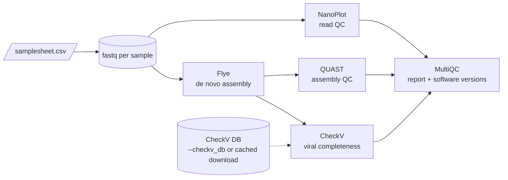

# Nanopore phage assembly pipeline

[](https://github.com/GregorioVitor/VEO_assignment_VitorGregorio/actions/workflows/ci.yml)
[](https://www.nextflow.io/)
[](https://www.docker.com/)
[](https://sylabs.io/docs/)

A Nextflow pipeline that takes raw Oxford Nanopore reads from one or more samples,
assembles each one de novo and checks the result. It covers read QC, assembly,
assembly QC and viral genome completeness, and summarises everything in one MultiQC report.

I first wrote it for a bioinformatics assignment from the VEO group, where the
sample turned out to be a Vibrio phage (one circular contig of 58.8 kb, rated
High-quality by CheckV with 96.95% completeness). The write-up of that analysis
is in [docs/VEO_report_VitorGregorio.pdf](docs/VEO_report_VitorGregorio.pdf).
The code as submitted is preserved under the tag
[`v1.0-assignment`](https://github.com/GregorioVitor/VEO_assignment_VitorGregorio/tree/v1.0-assignment);
see [Version history](#version-history) for what changed since.

## Pipeline overview



| Step | Tool | Version | Container |
| --- | --- | --- | --- |
| Read QC | [NanoPlot](https://github.com/wdecoster/NanoPlot) | 1.46.2 | `quay.io/biocontainers/nanoplot:1.46.2--pyhdfd78af_1` |
| Assembly | [Flye](https://github.com/mikolmogorov/Flye) | 2.9.6 | `quay.io/biocontainers/flye:2.9.6--py310h275bdba_0` |
| Assembly QC | [QUAST](https://github.com/ablab/quast) | 5.3.0 | `quay.io/biocontainers/quast:5.3.0--py313pl5321h5ca1c30_2` |
| Viral completeness | [CheckV](https://bitbucket.org/berkeleylab/checkv) | 1.0.3 (DB v1.5) | `quay.io/biocontainers/checkv:1.0.3--pyhdfd78af_0` |
| Report | [MultiQC](https://multiqc.info) | 1.34 | `quay.io/biocontainers/multiqc:1.34--pyhdfd78af_0` |

All images are pinned to an exact Bioconda build, so a given release of the
pipeline always runs the same software.

## Quick start

You need [Nextflow](https://www.nextflow.io/docs/latest/install.html) 25.10.0 or later
and one of Docker, Singularity/Apptainer or Conda.

Try it on the bundled test data (two small simulated phage lambda samples, a few minutes on a laptop):

```bash
nextflow run GregorioVitor/VEO_assignment_VitorGregorio -profile test,docker --outdir results
```

Run it on your own data:

```bash
nextflow run GregorioVitor/VEO_assignment_VitorGregorio \
    -profile docker \
    --input samplesheet.csv \
    --outdir results
```

`nextflow run GregorioVitor/VEO_assignment_VitorGregorio --help` lists every parameter.

## Input

A CSV samplesheet with one row per sample:

```csv
sample,fastq
1_024_O,/data/1_024_O.fastq.gz
phage_02,reads/phage_02.fastq.gz
```

| Column | Description |
| --- | --- |
| `sample` | Unique sample id. Letters, digits, `.`, `_` and `-` only. It names every output file. |
| `fastq` | Nanopore reads (`.fastq`, `.fq`, optionally gzipped). Relative paths are resolved against the folder that contains the samplesheet. |

The samplesheet is validated against [assets/schema_input.json](assets/schema_input.json)
before anything runs, so a typo or a duplicated sample id fails straight away.

## Parameters

| Parameter | Default | Description |
| --- | --- | --- |
| `--input` | | Samplesheet CSV (required). |
| `--outdir` | `results` | Where results are published. |
| `--flye_mode` | `nano-raw` | Flye read type: `nano-raw`, `nano-hq`, `nano-corr`, `pacbio-raw`, `pacbio-corr` or `pacbio-hifi`. Use `nano-hq` for recent Dorado basecalls. |
| `--flye_meta` | `false` | Run Flye with `--meta`, useful when coverage is uneven. |
| `--genome_size` | | Expected genome size for Flye, e.g. `60k`. Optional. |
| `--skip_checkv` | `false` | Skip CheckV. |
| `--checkv_db` | | Existing CheckV database directory (`checkv-db-v1.5`). |
| `--checkv_db_cache` | `databases` | Where the CheckV database is downloaded when `--checkv_db` is not given. |
| `--publish_dir_mode` | `copy` | How files are written to `--outdir` (`copy`, `symlink`, `link`, ...). |

The full definitions live in [nextflow_schema.json](nextflow_schema.json).

### CheckV database

If you already have the database, pass it with `--checkv_db /path/to/checkv-db-v1.5`.
Otherwise the pipeline downloads it once (about 1.4 GB to download, 6.4 GB unpacked) into `--checkv_db_cache`
and reuses that copy on every later run. It is never copied into `--outdir`.

### Compute resources

Each process has a resource label (`process_single`, `process_low`, `process_medium`,
`process_high`) defined in [conf/base.config](conf/base.config). Requests are capped
by `process.resourceLimits`, which defaults to 16 CPUs and 64 GB. To fit a smaller
machine or a cluster, pass a config file with `-c`:

```groovy
// custom.config
process {
    resourceLimits = [cpus: 8, memory: 32.GB, time: 12.h]
    withName: FLYE { cpus = 8 }
}
```

### Profiles

| Profile | What it does |
| --- | --- |
| `docker` | Runs every process in its Docker container. |
| `singularity`, `apptainer` | Same images, pulled and converted for HPC systems without Docker. |
| `conda` | Builds a Bioconda environment per process instead of using containers. |
| `test` | Small bundled dataset. Combine it with a container profile: `-profile test,docker`. |

## Output

```
results/
├── qc/
│   ├── nanoplot/<sample>_nanoplot/      read length/quality plots and NanoStats
│   └── quast/<sample>_quast/            assembly statistics (report.tsv, report.html)
├── assembly/<sample>/
│   ├── <sample>.assembly.fasta          contigs, renamed <sample>_contig_N
│   ├── <sample>.assembly_info.txt       length, coverage and circularity per contig
│   ├── <sample>.assembly_graph.gfa      assembly graph (open it in Bandage)
│   └── <sample>.flye.log
├── checkv/<sample>_checkv/              quality_summary.tsv, completeness.tsv, contamination.tsv, ...
├── multiqc/
│   ├── multiqc_report.html              all samples in one report, with software versions
│   └── multiqc_report_data/
└── pipeline_info/
    ├── veo_software_mqc_versions.yml    exact tool versions used in the run
    └── execution_{report,timeline,trace}.*
```

## Testing

Tests use [nf-test](https://www.nf-test.com) and run on every push and pull request
through [GitHub Actions](.github/workflows/ci.yml), on the oldest supported Nextflow
and on the latest stable release.

```bash
nf-test test --profile +docker
```

- **test profile:** assembles both simulated lambda samples for real and checks that
  each gives a single ~48 kb contig, that the MultiQC report is built and that tool
  versions are recorded once.
- **stub:** runs the whole workflow, CheckV database download included, with stub
  commands. This checks the channel logic for CheckV without fetching the 1.4 GB database in CI.

The test reads and the script that made them are in [tests/data](tests/data).

## Version history

The tag `v1.0-assignment` is the pipeline exactly as I handed it in. Version 2.0.0
reworks it into something closer to a production pipeline. The main changes:

- containers pinned to exact Bioconda builds instead of `:latest`;
- a validated samplesheet and meta map, so any number of samples run in parallel
  without output collisions;
- the CheckV database is a parameter, with an optional one-time cached download;
- resources come from labels in `conf/base.config`, and there are profiles for
  Docker, Singularity, Apptainer, Conda and testing;
- `nextflow_schema.json`, `--help`, per-tool `versions.yml` collected into MultiQC;
- nf-test tests and CI;
- BUSCO removed. It does not suit phage genomes, as the original report explains.

[CHANGELOG.md](CHANGELOG.md) has the full list, and the diff is at
[v1.0-assignment...main](https://github.com/GregorioVitor/VEO_assignment_VitorGregorio/compare/v1.0-assignment...main).

## Author

Vitor Gregorio ([@GregorioVitor](https://github.com/GregorioVitor))
